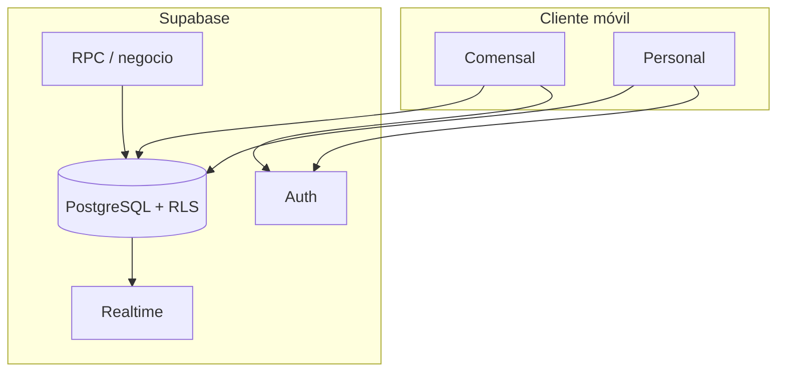

<div align="center">

<pre>
╔═══════════════════════════════════════════════════════════╗
║                        FastTable                          ║
║         Reservas · menú · cocina · sala · gerencia        ║
╚═══════════════════════════════════════════════════════════╝
</pre>

[](https://www.ipn.mx)
[](https://github.com/aletzsc/FastTable)

<br />

</div>

Aplicación móvil para **operar un restaurante de punta a punta**: el comensal reserva, ordena y consulta su cuenta; el personal atiende mesas, solicitudes y reservas; cocina recibe pedidos y administra la carta; gerencia visualiza indicadores. Todo sobre **un backend único** (PostgreSQL, políticas RLS, funciones RPC y **Realtime** para reflejar cambios sin recargar a mano).

---

## Funciones por rol

| Rol | Capacidades principales |
|-----|-------------------------|
| Comensal | Mesas y reservas, carta, pedidos a cocina, cuenta estimada, fila virtual, solicitudes |
| Sala (mesero / anfitrión) | Reservas a atender, solicitudes, mesas asignadas, control de ocupación |
| Cocina | Cola de pedidos, disponibilidad de platos (centro de control) |
| Gerencia | Indicadores (ingresos, platos, equipo, no disponibles) |

---

## Arquitectura



La **fuente de verdad** es la base de datos; la app solo orquesta permisos y experiencia por rol.

---

## Requisitos

- **Node.js** (LTS) y **npm**
- Proyecto **Supabase** con el esquema aplicado: ver `supabase/EJECUCION.txt`
- Archivo **`.env`** con `EXPO_PUBLIC_SUPABASE_URL` y `EXPO_PUBLIC_SUPABASE_ANON_KEY` (plantilla: `.env.example`). La *service role* solo en máquina local para scripts administrativos, nunca en builds públicos.

---

## Arranque rápido

```bash
npm install
cp .env.example .env
# Edita .env con tu proyecto Supabase
npm start
```

Cuentas demo del personal: `supabase/DEMO_CUENTAS.txt` · scripts `npm run demo:workers` y `npm run staff:console` (requieren `SUPABASE_SERVICE_ROLE_KEY` en local).

---

## Scripts

| Comando | Descripción |
|---------|-------------|
| `npm start` | Desarrollo (Expo) |
| `npm run demo:workers` | Alta de usuarios demo de personal |
| `npm run staff:console` | Consola local para gestionar fichas de personal |

---

## Base de datos

| Recurso | Contenido |
|---------|-----------|
| `supabase/01_reconstruir_db.sql` | Esquema completo (nuevas instalaciones) |
| `supabase/EJECUCION.txt` | Orden de ejecución y parches |
| `supabase/GUIA_ALTERAR_DB.txt` | Guía para alterar el esquema con cuidado |

---

<div align="center">

**Instituto Politécnico Nacional** · *La técnica al servicio de la patria*

[](https://www.ipn.mx)

<br />

<sub>FastTable — documentación del producto. El runtime (Expo / React Native) es el vehículo; el dominio es la operación del restaurante.</sub>

</div>
